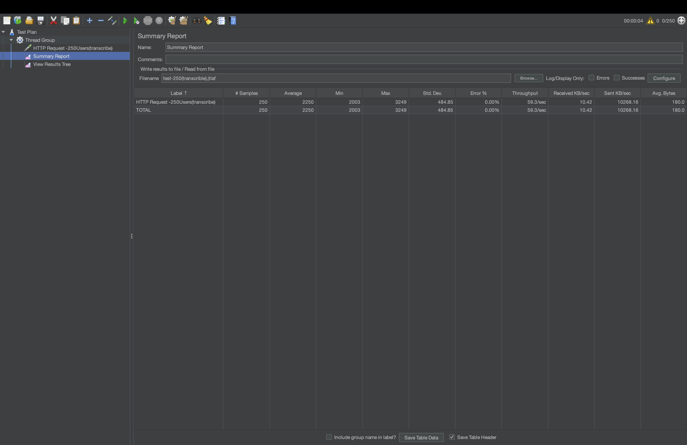

# Assignment 1 - Speech to Text Web Application

## Overview
A website that allow user to make a recording and get the transcribe of that recording

## API Endpoints
- `/api/v1/audio/transcribe`
- `/api/v1/admin/uptime`
- `/api/v1/global/stats`
- `/api/v1/admin/shutdown`

## Testing

TITAN: 11/11 functional tests passed.

JMeter concurrency test:

- 250 concurrent blocking transcription requests
- 0% errors
- Average response time: 2250 ms
- Maximum response time: 3249 ms

The request was simulated using a 2 second test instead of the real OpenAI API

## Test Evidence 

